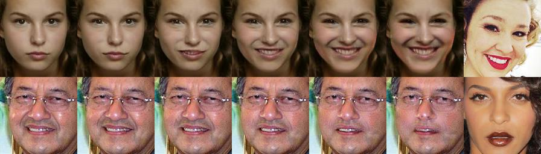
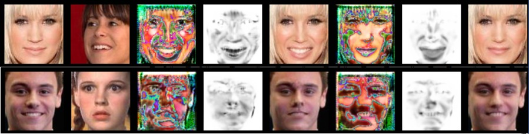
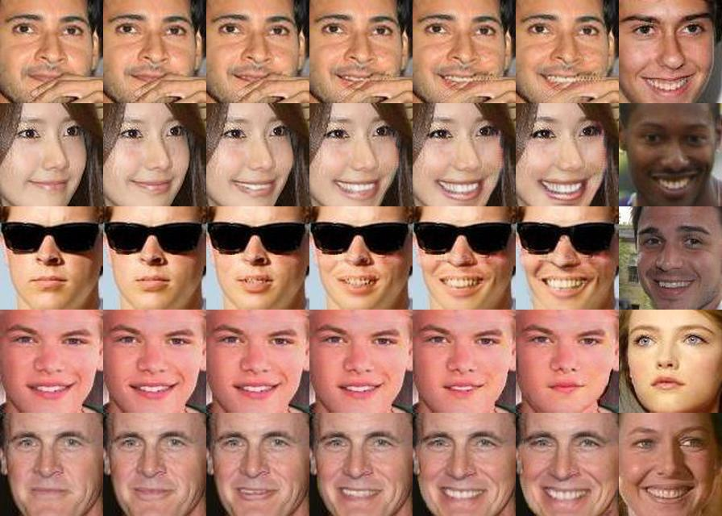
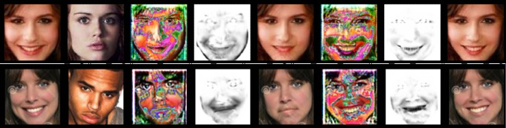
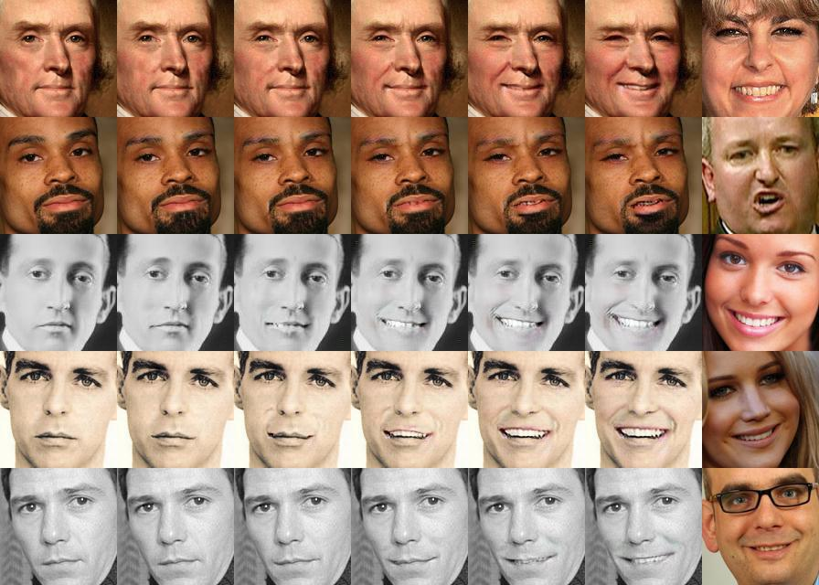

# GANimation -- An Out-of-the-Box Replicate

## Pros (compared with the [official](https://github.com/albertpumarola/GANimation) implementation)

* Codes are cleaner and well structured, inspired by the [pytorch-CycleGAN-and-pix2pix](https://github.com/junyanz/pytorch-CycleGAN-and-pix2pix).
* Provide a more powerful test function for generating **linear interpolations** between two expressions as shown in the paper.
* Provide a **preprocessed [CelebA](http://mmlab.ie.cuhk.edu.hk/projects/CelebA.html) dataset**, including cropped faces, Action Units related to all cropped faces, train and test split.
* Provide **pretrained models** for the above CelebA dataset, including both generator and discriminator.
* Provide useful scripts for extracting Action Units throughout the dataset (will release soon).
* Provide Action Units vector for the [EmotionNet](https://cbcsl.ece.ohio-state.edu/EmotionNetChallenge/index.html) extracted using [OpenFace](https://github.com/TadasBaltrusaitis/OpenFace) (will release soon).
* Provide pretrained models for the [EmotionNet](https://cbcsl.ece.ohio-state.edu/EmotionNetChallenge/index.html) dataset (will release soon).



## Getting Started

### Requirements

* Python 3
* PyTorch 0.4.1
* visdom (optional, only for training with browser visualizer)

### Installation

* Clone this repo:

```
git clone https://github.com/donydchen/ganimation_replicate
cd ganimation_replicate
```

### Download Resources

* All resources related to this project are located [here](https://drive.google.com/open?id=1MijMc6QnjrNFopT1G43WQFeei9ddcaza).         
* Download `datasets` and put it in the root path of this project.       
* Download `ckpts` and put it in the root path of this project. (optional, only for test or finetune)

### Train

* To view training results and loss plots, run `python -m visdom.server` and click the URL [http://localhost:8097](http://localhost:8097)

```
python main.py --data_root [path_to_dataset]

# e.g. python main.py --data_root datasets/celebA --gpu_ids 0,1 --sample_img_freq 500
#      python main.py --data_root datasets/emotionNet --gpu_ids 0,1 --sample_img_freq 500
#      set '--visdom_display_id 0' if you don't want to use visdom
#      use 'python main.py -h' to check out more options.
```

### Test

* Make sure you have trained the model or downloaded the pretrained model.

```
python main.py --mode test --data_root [path_to_dataset] --ckpt_dir [path_to_pretrained_model] --load_epoch [epoch_num]

# e.g. python main.py --mode test --data_root datasets/celebA --batch_size 8 --max_dataset_size 150 --gpu_ids 0,1 --ckpt_dir ckpts/celebA/ganimation/190327_161852/ --load_epoch 30
#      set '--interpolate_len 1' if you don't need linear interpolation.
```

### Finetune

```
python main.py --data_root [path_to_dataset] --ckpt_dir [path_to_existing_checkpoint] --load_epoch [epoch_num] 

# e.g. python main.py --data_root datasets/celebA --gpu_ids 0,1 --sample_img_freq 300 --n_threads 18 --ckpt_dir ckpts/celebA/ganimation/190327_161852 --load_epoch 30 --epoch_count 31 --niter 30 --niter_decay 10
```


## Some Results

### CelebA 

**Training** 



**Testing**



### EmotionNet （Visual quality is much better than that of CelebA）

**Training**



**Testing**



## Why this Project?

My [mentor](https://jianfeng1991.github.io/personal/) came up with a fancy idea of playing GANs with AUs when I was an intern at AI Lab, [Lenovo Research](http://research.lenovo.com/webapp/view_English/index.html) around early August, 2018. I enjoyed the idea very much and started working on it. However, just a few days after that, the GANimation paper showed up, which was not a good news for us... So I tried to replicate GANimation, and this is the start of this project. 

And in late August, 2018, I came accross an [issue](https://github.com/albertpumarola/GANimation/issues/22) on the official GANimation implementation, claiming that the test result is wrong. While in my case, I did get some reasonable results, so I replied that issue with the results I had got. Since the author of GANimation hadn't decided to release the pretrained model yet, I recieved Emails inquiring me whether I could offer my codes and pretrained models from time to time. 

I really wanted to provide the codes and pretrained models. However, I was very busy in the past few months, moving from Beijing to Singapore, working for paper deadlines, so on and so forth. So the codes remained in the server of Lenovo Research for half an year. And these days, I finally got some free time. So I dug out the codes, cleaned them, retrained the network, and now, I make them public. I will keep updating this project if I have time, and hope that these codes can serve to faciliate the research of someone who are working on the related tasks. 

Feel free to contact me if you need any help from me related to this project.

## Pull Request 

You are always welcome to contribute to this repository by sending a [pull request](https://help.github.com/articles/about-pull-requests/).


